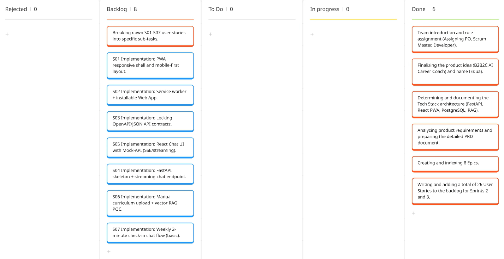
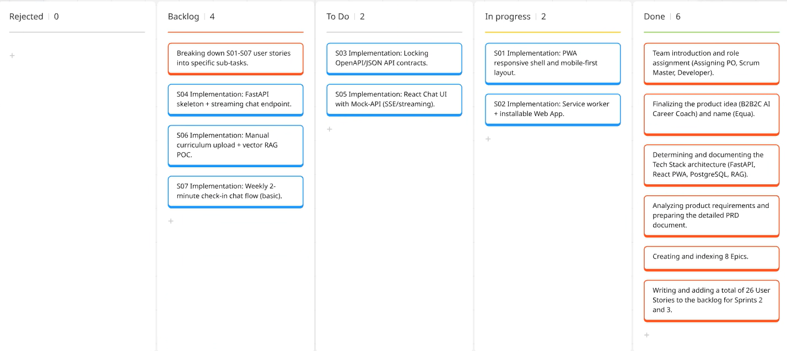
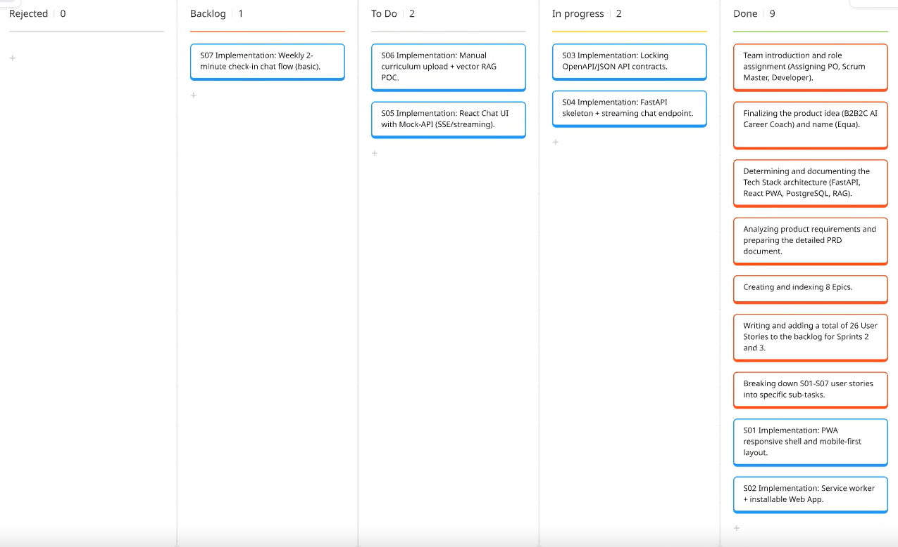

# **Takım İsmi**

Takım 320

# Ürün İle İlgili Bilgiler

## Takım Üyeleri

- Dilan Özyazıcı: Product Owner
- Mustafa Kurtar: Scrum Master
- Elif Kahrıman: Team Member / Developer
- Hafize Talya Keysan: Team Member / Developer
- Hasibe Nur Tunç: Team Member / Developer

## Ürün İsmi

--Equa--

## Ürün Açıklaması

- Equa, bootcamp, akademi ve üniversite gibi yoğun eğitim süreçlerinden geçen öğrenciler için tasarlanmış, B2B2C modeliyle çalışan yapay zeka destekli bir kariyer ve kapasite koçudur. Kurumların müfredatını baz alarak öğrencinin gelişimini analiz eder ve sürdürülebilir haftalık aksiyon planları sunar. Kurumlara ise dropout risklerini proaktif tespit eden bir ROI dashboard'u sağlar.

## Ürün Özellikleri

- PWA destekli duyarlı (responsive) Web App (mobil-first)
- Haftalık 2 dakikalık AI check-in asistanı (streaming chat)
- Kurum müfredatına dayalı RAG tabanlı görev önerisi
- Öğrenci kapasitesine göre haftalık max 3 görev atama
- Kurumlar için öğrenci risk sinyalleri (Yeşil, Sarı, Kırmızı) dashboard'u
- Önlenen dropout sayısı ve korunan gelir (ROI) metrikleri

## Hedef Kitle

- Bootcamp ve akademi öğrencileri (birincil kullanıcı — "Bunalmış Can")
- Eğitim kurumu koordinatörleri (ikincil kullanıcı — "Kör Uçuşundaki Zeynep")
- 100+ öğrencinin başarısından sorumlu eğitim profesyonelleri
- Teknik bootcamp ve kariyer hazırlık programları

## Product Backlog URL

[Story Backlog (specs/stories)](specs/stories/README.md) · [Epic İndeksi (specs/epics)](specs/epics/README.md) · [PRD](specs/prds/prd.md) · [Tech Stack](specs/techstack.md)

## Daily Scrum Notları

Toplantılar bootcamp sürecinde Slack ve Google Meets üzerinden yürütülmüştür. Aşağıda önemli günlük notlar kronolojik olarak özetlenmiştir.

### 22.06.2026

- Ekip tanışması yapıldı.
- Ürün **teması** üzerinde konuşuldu; çevresel ve toplumsal temalara yönelindi.
- Scrum Master ve Product Owner belirlendi.

### 25.06.2026

- Proje fikri üzerine toplantı yapıldı.
- Proje fikri kesinleştirildi.
- Takım bilgilendirme formu doldurularak gönderildi.

### 29.06.2026

- Proje fikri için **kullanım senaryoları** üzerinde çalışıldı.
- **Ürün ismi** tartışmaları yapıldı.
- Dokümantasyon için **Google Docs** oluşturuldu.
- Fikre yönelik öneriler, eksiklikler ve analizler; ekip üyeleri tarafından süre ve gün fark etmeksizin dokümana eklendi.

### 03.07.2026

- Dokümantasyonda belirlenen kriterlere göre **elemeler** yapıldı.
- **Ürün ismi kesinleştirildi:** Equa.
- **Ürün kapsamı** belirlendi.
- Gerekli dokümanlar oluşturuldu:
  - [PRD](specs/prds/prd.md)
  - [Epic'ler](specs/epics/README.md)
  - [User Stories](specs/stories/README.md)
- Sprintler için **planlama** yapıldı.
- Kodlama aşamasına geçmeden önce fikrin detaylı planlanmasının daha mantıklı olduğuna karar verildi:
  - **Sprint 1:** Planlama, derinleşme ve analiz
  - **Sprint 2 ve 3:** Ürün geliştirme, test etme ve production aşamaları

### 07.07.2026

- Sprint 1 sonucu oluşan user story'ler 4 parçaya bölündü: **AI, Backend, Frontend ve Database**.
- İsteklere ve yetkinliklere göre bu alanlarda ekip görev dağılımı yapıldı.

### 09.07.2026

- Push'larda conflict oluşması ve ilerlemenin takip edilememesi sonucunda toplanıldı; çözüm olarak [progress.md](progress.md) oluşturuldu.
- `progress.md` dosyasında 4 ana dalın görevleri dağıtıldı ve ilerleme takibi sağlaması için **her push'ta bu dosyanın güncellenmesi** gerektiği kararlaştırıldı.

### 14.07.2026

- İlerlemelerdeki mevcut durum konuşuldu; projeyi yaparken karşılaşılan problemler belirlendi.
- AI tarafında projeye uygun kullanılacak model için **araştırma yapılmasına** karar verildi.

### 19.07.2026

- Sprint 2 öncesi son push'lar kontrol edildi, gereklilikler tamamlandı.
- Sprint 2'de bitmeyen görevler **Sprint 3'e aktarıldı** ve projeyi canlıya almak için gerekli altyapı hazırlandı.

---

# Sprint 1

**Sprint Hedefi (Gün 1–14):** Ekip olarak tanışmak, proje mimarisini oluşturmak; detaylı PRD, epic ve story dokümanlarını hazırlayarak tech stack ve architecture kararlarını netleştirmek.

- **Backlog düzeni ve Story seçimleri**: Sprint 1'de kod geliştirmesi yapılmamıştır. Backlog'umuz ürün gereksinimlerini analiz ederek planlama ve dokümantasyon odaklı ilerlemiştir. Story başına çıkan tahmin puanı, toplam puanın yarısından az tutulmuştur.

  Sprint 1 teslim çıktıları:

  | Çıktı | Konum | Açıklama |
  |-------|-------|----------|
  | PRD | [specs/prds/prd.md](specs/prds/prd.md) | Equa MVP ürün gereksinimleri |
  | Epic'ler | [specs/epics/](specs/epics/README.md) | 8 epic + indeks |
  | Story Backlog | [specs/stories/](specs/stories/README.md) | 26 story (Sprint 2–3 için plan) |
  | Tech Stack | [specs/techstack.md](specs/techstack.md) | FastAPI, React PWA, PostgreSQL, RAG mimarisi |

  Kod implementasyonu (S01–S07) Sprint 2 backlog'una alınmıştır. Story'ler yapılacak işlere (task'lere) bölünmüştür. Detaylar: [specs/stories/README.md](specs/stories/README.md)

- **Daily Scrum**: Daily Scrum toplantılarının zamansal sebeplerden ötürü Slack üzerinden yapılmasına karar verilmiştir. Daily Scrum toplantısı örneği word olarak Readme'de tarafımızdan paylaşılmaktadır: [Sprint 1 Daily Scrum Chats](<kanban-board/SPRINT 1.docx>)

- **Sprint board update**: Sprint 1 board görünümü:

- **Ürün Durumu**: Sprint 1 kapsamında çalışan bir ürün demosu bulunmamaktadır; teslim çıktıları dokümantasyon ve mimari planlama düzeyindedir.

- **Sprint Review**: 
Alınan kararlar: Takım 320 olarak ekip tanışması ve rol dağılımı (PO, Scrum Master, Developer) tamamlandı. Equa için detaylı PRD yazıldı; 8 epic ve 26 story ile backlog oluşturuldu. Tech stack (FastAPI + Python backend, React PWA frontend, PostgreSQL + pgvector, S3, Bedrock/LLM + RAG) ve katmanlı mimari kararları [specs/techstack.md](specs/techstack.md) dosyasında belgelendi. Kod geliştirmesi Sprint 2'de başlayacak şekilde S01–S07 story'leri backlog'a işlendi. Sprint Review katılımcıları: Takım 320 (Dilan Özyazıcı, Mustafa Kurtar, Elif Kahrıman, Hafize Talya Keysan, Hasibe Nur Tunç)

- **Sprint Retrospective:**
  - Sprint 1'de önce planlama ve dokümantasyon yapmak, takımın ürün vizyonu ve mimari üzerinde ortak fikir birliğine varmasını sağladı
  - Ekip tanışması ve rol netliği bootcamp sürecinin geri kalanı için iyi bir temel oluşturdu
  - Sprint 2'de kod yazımına geçerken görev dağılımının daha somut yapılması ve story point tahminlerinin gerçek implementasyon deneyimiyle güncellenmesi gerekiyor

---

# Sprint 2

**Sprint Hedefi:** Sprint 1'de planlanan ve 4 alana (AI, Backend, Frontend, Database) bölünen user story'lerin geliştirilmesine başlamak; veritabanı altyapısını, backend iskeletini ve AI streaming katmanını hayata geçirmek. İlerlemenin conflict yaşanmadan takip edilebilmesi için [progress.md](progress.md) tabanlı çalışma düzenine geçmek.

- **Backlog düzeni ve Story seçimleri**: Sprint 1'de oluşturulan user story'ler (S01–S07) yetkinliklere göre AI, Backend, Frontend ve Database olmak üzere 4 alana bölünerek ekip üyelerine dağıtıldı. Görev takibi [progress.md](progress.md) üzerinden yapılmıştır ve her push'ta güncellenmiştir.

  Sprint 2 kapsamında öncelik **Database ve Backend** altyapısına verildi; AI streaming katmanı geliştirilmeye başlandı, Frontend ise bu sprintte başlatılmadı.

  | Alan | Durum | Öne çıkan çıktılar |
  |------|-------|--------------------|
  | Database | Tamamlandı | PostgreSQL + pgvector, Alembic migration, temel tablolar, RLS, seed verisi, cross-tenant test |
  | Backend | Kısmen tamamlandı | FastAPI iskelet, katmanlı mimari, response envelope, Pydantic şemalar, structured logging, `.env.example` |
  | AI Agent | Kısmen tamamlandı | LLM sağlayıcı seçimi (OpenAI), LangChain bağımlılıkları, streaming yanıt fonksiyonu, check-in prompt taslağı, guardrails keyword listesi |
  | Frontend | Başlanmadı | Sprint 3'e aktarıldı |

  Detaylı görev bazlı ilerleme: [progress.md](progress.md)

- **Daily Scrum**: Daily Scrum toplantıları Slack ve Google Meets üzerinden yürütülmüştür. Sprint 2 sürecine ait toplantı notları yukarıdaki [Daily Scrum Notları](#daily-scrum-notları) bölümünde (07.07 – 19.07.2026) özetlenmiştir. Toplantı kayıtları word olarak paylaşılmaktadır: [Sprint 2 Daily Scrum Chats](<kanban-board/SPRINT 2.docx>)

- **Sprint board update**: Sprint 2 board görünümü (sprint başı ve sprint ilerleyişi):

- **Ürün Durumu**: Sprint 2 sonunda henüz bir frontend arayüzü bulunmamaktadır. Bu sprintte **Backend ve Database** katmanları üzerinde çalışılmıştır. Veritabanı (PostgreSQL + pgvector + RLS + seed) altyapısı tamamlanmış, FastAPI backend iskeleti ile AI streaming katmanı kısmen hayata geçirilmiştir. Çalışan uçtan uca kullanıcı demosu Sprint 3'e planlanmıştır.

- **Sprint Review**: 
Alınan kararlar: Sprint 2'de user story'ler 4 alana bölünerek geliştirmeye geçildi. Database katmanı tümüyle tamamlandı (şema, pgvector, RLS, seed verisi, cross-tenant izolasyon testleri). Backend tarafında FastAPI iskeleti, katmanlı mimari, standart response envelope, Pydantic şemaları ve loglama tamamlandı; OpenAPI kontratının kilitlenmesi ve streaming endpoint gibi görevler devam ediyor. AI tarafında LLM sağlayıcı olarak OpenAI seçildi, LangChain entegrasyonu ve streaming yanıt fonksiyonu geliştirildi. Frontend bu sprintte başlatılamadı; frontend story'leri ve tamamlanamayan backend/AI görevleri Sprint 3'e aktarıldı. Sprint Review katılımcıları: Takım 320 (Dilan Özyazıcı, Mustafa Kurtar, Elif Kahrıman, Hafize Talya Keysan, Hasibe Nur Tunç)

- **Sprint Retrospective:**
  - Push'larda yaşanan conflict ve takip zorluğu, `progress.md` dosyasının oluşturulması ve her push'ta güncellenmesiyle büyük ölçüde çözüldü; bu düzen ekip içi görünürlüğü artırdı
  - Database ekibi hedeflerini tam tamamladı; Backend ve AI görevlerinde bağımlılıklar (örn. streaming endpoint'in AI katmanına bağlanması) tahmin edilenden fazla zaman aldı
  - AI tarafında projeye uygun modelin netleştirilmesi için ek araştırma ihtiyacı doğdu; bu Sprint 3'e taşındı
  - Frontend'e bu sprintte hiç başlanamaması, Sprint 3'ün yükünü artırdı; Sprint 3'te frontend ve entegrasyon önceliklendirilecek

---

# Sprint 3

---
