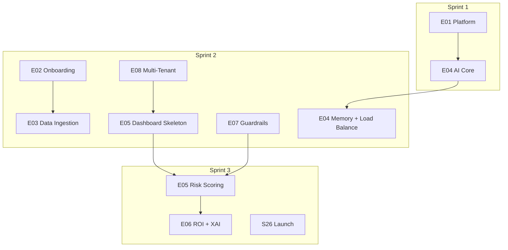

# Equa Epic İndeksi

**Kaynak PRD:** [specs/prds/prd.md](../prds/prd.md)  
**Ürün:** Equa MVP v1.0  
**Geliştirme:** 3 Sprint (6 Hafta)

## Epic Özeti

| Epic | Başlık | PRD Ref | Hedef Sprint | Story'ler |
|------|--------|---------|--------------|-----------|
| [E01](E01-platform-foundation.md) | Platform Foundation & PWA | FR1, Roadmap S1 | Sprint 1 | S01, S02, S03, S26 |
| [E02](E02-student-onboarding.md) | Chat Tabanlı Onboarding & Teşhis | FR2 | Sprint 2 | S08, S09 |
| [E03](E03-data-ingestion-profile.md) | PDF Veri Çıkarma & Fallback Akışı | FR3, FR4 | Sprint 2 | S10, S11, S12 |
| [E04](E04-ai-checkin-memory.md) | AI Check-in, RAG Hafıza & Görev Dengeleme | FR5, FR6, FR7 | Sprint 1–2 | S04–S07, S13–S15, S26 |
| [E05](E05-b2b-risk-dashboard.md) | Kurum Risk Dashboard'u | FR8 | Sprint 2–3 | S20, S21, S22 |
| [E06](E06-roi-xai.md) | ROI Tracker & Explainable AI | FR9, Section 7 XAI | Sprint 3 | S23, S24, S25 |
| [E07](E07-ai-guardrails.md) | AI Guardrails & Kriz Yönlendirme | Section 7 Guardrails | Sprint 2 | S16, S17 |
| [E08](E08-multi-tenant-security.md) | Multi-Tenant Güvenlik & Veri İzolasyonu | Section 8 RLS, AC4 | Sprint 2 | S18, S19 |

## Sprint Haritası

## MVP Dışı (Won't)

- **FR10:** GitHub OAuth ile repo/commit kalitesi analizi
- WhatsApp, Telegram, Discord bot entegrasyonları
- Klinik psikolojik destek veya tıbbi teşhis

## İlgili Dokümanlar

- [Story Backlog](../stories/README.md)
- [Tech Stack](../techstack.md)
