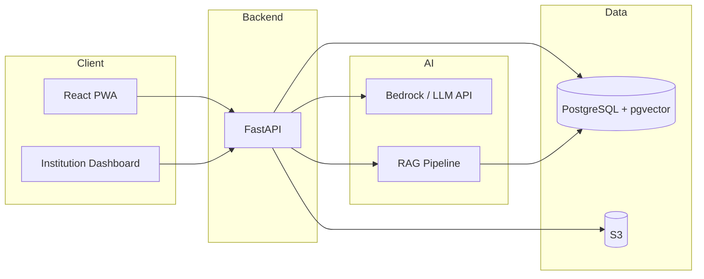

# Equa Tech Stack

**Kaynak:** [specs/prds/prd.md](prds/prd.md)  
**Epic'ler:** [specs/epics/README.md](epics/README.md)  
**Story'ler:** [specs/stories/README.md](stories/README.md)  
**Sürüm:** MVP 1.0  
**Tarih:** 4 Temmuz 2026

---

## 1. Genel Mimari

Equa, B2B2C SaaS modeliyle çalışan, mobile-first PWA (öğrenci) ve desktop dashboard (kurum) sunan yapay zeka destekli bir kariyer koçudur. Sistem asenkron AI işlemleri, streaming yanıtlar ve multi-tenant veri izolasyonu gerektirir.



**Proje tipi:** Web application (frontend + backend monorepo veya ayrı repo)  
**Hedef platform:** Cloud (AWS), mobile-first PWA + desktop browser  
**Geliştirme süresi:** 3 Sprint (6 hafta)

> **Not:** Workspace `.cursor/rules` Express + TypeScript tanımlar; Equa MVP PRD'ye uygun olarak **FastAPI + Python** backend kullanır. Katmanlı mimari prensibi (route → controller → service → repository) Python/FastAPI'ye uyarlanmıştır.

---

## 2. Technical Context

| Alan | Seçim |
|------|-------|
| **Language/Version** | Python 3.11+ (backend), TypeScript 5.x (frontend) |
| **Primary Dependencies** | FastAPI, Uvicorn, React 18, Vite, LangChain/LlamaIndex |
| **Storage** | Amazon RDS PostgreSQL, Amazon S3 |
| **Testing** | pytest, Vitest, React Testing Library, Playwright |
| **Target Platform** | AWS (RDS, S3, Bedrock), modern browsers (PWA) |
| **Performance Goals** | Streaming ilk token ≤ 2 sn; dashboard API p95 ≤ 500 ms |
| **Constraints** | Mobile-first, tenant isolation (RLS), ham sohbet kuruma gitmez |
| **Scale/Scope** | 2 pilot bootcamp, 100+ öğrenci/kurum, MVP 6 hafta |

---

## 3. Frontend

| Teknoloji | Kullanım | Story |
|-----------|----------|-------|
| **React 18** | UI framework | S01, S05, S20 |
| **TypeScript** | Tip güvenliği | Tüm frontend |
| **Vite** | Build tool, HMR | S01 |
| **PWA (Service Worker + Manifest)** | Installable Web App, offline kabuk | S01, S02 |
| **SSE / EventSource** | Streaming AI yanıtları | S05 |
| **TanStack Query** | Server state, cache | S20, S22 |
| **react-hook-form + Zod** | Form validasyonu | S08, S10 |
| **Responsive CSS / Tailwind** | Mobile-first layout | S01 |

**Öğrenci arayüzü:** Chat UI, onboarding, check-in (S05, S07, S08)  
**Kurum arayüzü:** Veri tabloları, risk badge'leri, ROI metrikleri (S20–S25)

**Paralel geliştirme:** Mock-API (OpenAPI kontratına uygun) ile frontend bağımsız geliştirilir (S03, S05).

---

## 4. Backend

| Teknoloji | Kullanım | Story |
|-----------|----------|-------|
| **FastAPI** | Async REST API, streaming endpoints | S04 |
| **Uvicorn** | ASGI server | S04 |
| **Pydantic** | Request/response validation | S03, S04 |
| **SQLAlchemy 2.x / asyncpg** | ORM, async DB | S18 |
| **Alembic** | DB migrations | S18 |
| **Pino / structlog** | Structured logging | Tüm backend |

### Katmanlı Mimari (Python uyarlaması)

```text
backend/
├── api/
│   ├── routes/          # HTTP routing, middleware wiring
│   ├── controllers/     # Request parse/validate, response format
│   └── dependencies/    # Auth, tenant context injection
├── services/            # Business logic (Express import yok)
├── repositories/        # DB access, domain entities
├── domain/
│   ├── schemas/         # Pydantic DTOs (shared with frontend via OpenAPI)
│   └── errors/          # AppError subclasses
└── tests/
```

**API versioning:** `/api/v1/...`  
**Response envelope:**

```json
{ "success": true, "data": {}, "meta": {} }
{ "success": false, "error": { "code": "SNAKE_CASE", "message": "...", "details": [] } }
```

---

## 5. Veritabanı

| Teknoloji | Kullanım | Story |
|-----------|----------|-------|
| **Amazon RDS PostgreSQL 15+** | İlişkisel veri, tenant izolasyonu | S18, S19 |
| **pgvector** | RAG vektör deposu (RDS extension) | S06, S13 |
| **Row-Level Security (RLS)** | Tenant izolasyonu (AC4) | S18, S19 |

### Temel Tablolar

| Tablo | Açıklama | Epic |
|-------|----------|------|
| `tenants` | Kurum (bootcamp) kayıtları | E08 |
| `users` | Öğrenci + koordinatör | E02, E08 |
| `student_profiles` | Kapasite skoru, hedefler | E02 |
| `competencies` | PDF'den çıkarılan yetkinlik JSON | E03 |
| `curricula` | Müfredat metadata | E04 |
| `curriculum_chunks` | RAG vektör chunk'ları | E04 |
| `checkin_sessions` | Haftalık check-in kayıtları | E04 |
| `weekly_tasks` | Atanan görevler (max 3) | E04 |
| `risk_signals` | Kurum risk sinyalleri (metadata only) | E05, E07 |
| `risk_rationale_logs` | XAI gerekçe logları | E06 |
| `roi_metrics` | Önlenen dropout, korunan gelir | E06 |

Tüm tablolarda `tenant_id` + RLS politikaları zorunludur.

---

## 6. Depolama (S3)

| Bucket / Prefix | İçerik | Story |
|-----------------|--------|-------|
| `{tenant_id}/curricula/` | Müfredat PDF/Docx | S06 |
| `{tenant_id}/profiles/` | LinkedIn PDF | S10 |
| `{tenant_id}/uploads/` | Geçici upload'lar | S10 |

**Erişim:** Pre-signed URL veya backend proxy; tenant prefix zorunlu.

---

## 7. AI Katmanı

| Teknoloji | Kullanım | Story |
|-----------|----------|-------|
| **Amazon Bedrock** (veya OpenAI/Anthropic API) | LLM inference | S04, S07 |
| **LangChain / LlamaIndex** | AI orchestration, RAG pipeline | S06, S13 |
| **Amazon Textract / LlamaParse** | PDF OCR, metin çıkarma | S11 |
| **Embedding model** (Bedrock Titan / OpenAI) | Vektör embedding | S06, S13 |
| **pgvector** | Vektör similarity search | S06, S13 |

### RAG Pipeline

1. Doküman chunk'lama (müfredat, check-in beyanları)
2. Embedding → pgvector insert
3. Query-time retrieve (top-k)
4. LLM prompt'a context inject
5. Müfredat dışı öneri filtresi (S14)

### Guardrails (S16, S17)

- Keyword detection engine (depresyon, intihar, bırakma)
- Compassionate redirect template
- Kuruma metadata-only sinyal (ham sohbet asla paylaşılmaz)

---

## 8. Güvenlik

| Konu | Uygulama | Story |
|------|----------|-------|
| **Authentication** | JWT (access + refresh), Bearer token | S18 |
| **Authorization** | Role-based (student, coordinator, admin) | S18, S20 |
| **Tenant isolation** | RLS + tenant_id + JWT claim | S18, S19 |
| **Input validation** | Pydantic strict schemas | S03, S04 |
| **Secrets** | Environment variables via config module | Tüm |
| **Guardrails** | Keyword filter, no clinical advice | S16, S17 |
| **Data privacy** | Ham sohbet kuruma gitmez | S17 |

---

## 9. Test & DevOps

| Araç | Kapsam | Story |
|------|--------|-------|
| **pytest** | Backend unit + integration | S04, S18, S19 |
| **Vitest + RTL** | Frontend component tests | S01, S05 |
| **Playwright** | E2E user journeys | S26 |
| **docker-compose** | Local dev (API, Postgres, Redis opsiyonel) | S04 |
| **OpenAPI / Swagger** | Contract-first, mock server | S03 |
| **GitHub Actions** | CI (lint, test, AC4 suite) | S19, S26 |

---

## 10. Epic → Teknoloji Haritası

| Epic | Frontend | Backend | DB | AI | Storage |
|------|----------|---------|-----|-----|---------|
| **E01** Platform | React PWA, SW | OpenAPI | — | — | — |
| **E02** Onboarding | Chat UI | FastAPI chat | PostgreSQL | LLM | — |
| **E03** Data Ingestion | Upload UI | S3 + async job | PostgreSQL | Textract, LLM | S3 |
| **E04** AI Check-in | Chat UI, SSE | Streaming API | pgvector | RAG, LLM | S3 |
| **E05** B2B Dashboard | Data tables | Risk API | PostgreSQL | — | — |
| **E06** ROI + XAI | Dashboard widgets | Metrics API | PostgreSQL | — | — |
| **E07** Guardrails | Chat UI | Keyword engine | PostgreSQL | LLM (filtered) | — |
| **E08** Multi-Tenant | — | RLS middleware | PostgreSQL RLS | — | S3 prefix |

---

## 11. Sprint → Teknoloji Odakları

| Sprint | Teknoloji Odakları | Story'ler |
|--------|-------------------|-----------|
| **Sprint 1** | React PWA, OpenAPI, FastAPI streaming, RAG POC | S01–S07 |
| **Sprint 2** | PostgreSQL RLS, S3 upload, OCR/LLM, guardrails, dashboard skeleton | S08–S21 |
| **Sprint 3** | Risk scoring, ROI metrics, XAI logs, Playwright E2E, production deploy | S22–S26 |

---

## 12. MVP Dışı Bırakılanlar (Won't)

| Öğe | PRD Ref | Gerekçe |
|-----|---------|---------|
| GitHub OAuth repo analizi | FR10 | MVP scope dışı |
| WhatsApp/Telegram/Discord bot | Non-Goals | Gizlilik, UX |
| Klinik psikolojik destek | Non-Goals | Etik sınırlar |
| Harici Vector DB (Pinecone/Weaviate) | Section 8 | MVP'de pgvector yeterli |
| ML tabanlı dropout tahmin | — | MVP'de kural tabanlı skorlama |
| Express + TypeScript backend | Workspace rules | PRD FastAPI tercih edildi |

---

## 13. İlgili Dokümanlar

- [PRD](prds/prd.md)
- [Epic İndeksi](epics/README.md)
- [Story Backlog](stories/README.md)
- [Spec Kit Workflow](../.specify/workflows/speckit/workflow.yml)
